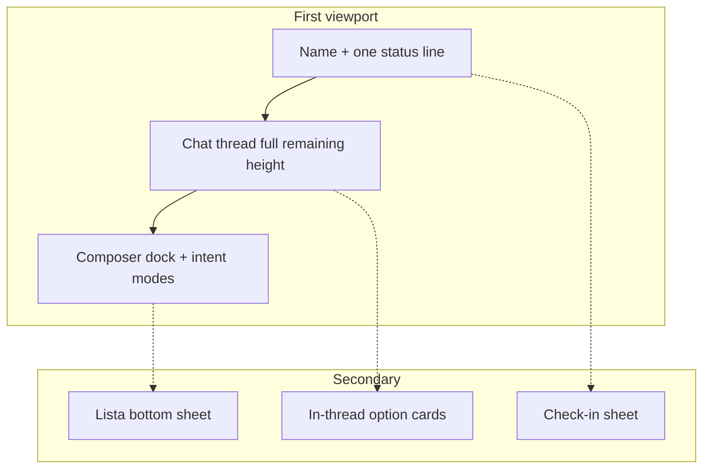

# Luna Home — Chat-first redesign

**Date:** 2026-07-23  
**Surface:** Today (`artifacts/her-planner`) + shell (`layout.tsx`)  
**Status:** Design locked for implementation (Alec: research + decide; Section 1 approved; deepen + continue)

---

## 0. Fundamental job

Open Luna and feel she already holds the day — **one next move** — not a dashboard of widgets.

She (product subject) + Alec (builder) already named this: half secretary / journal / helper / best friend; Spanish-default PWA; “minimal and stunning”; Perplexity/Grok-smooth; always-on personalizer on phone, browser, later ChatGPT.

**Not:** denser planner, Expo rings-first home, phone stub on desktop.

---

## 1. Deeper failure map (why it feels ugly / expands / lazy)

### Structural (root)

| Failure | Evidence | Effect |
|---------|----------|--------|
| **Five peers** | Header + 3 chips + chat + IntentSwimlane + suggestions card + task list | Nothing owns the frame; eye has no rest |
| **Phone chrome on PC** | `layout.tsx` `max-w-md mx-auto shadow-2xl` | Reads as mock, wastes screen, “first app” |
| **Nested scroll** | `main` scrolls (`pb-24`) AND chat `flex-1 overflow-y-auto` AND list `max-h-40` | Chat grows → page fights itself; “why does this expand” |
| **Swimlane tax** | Infinite duplicated chips above composer | Tall, noisy, steals first viewport |
| **Suggestions + list** | Both below chat as permanent peers | Secretary residue competes with the conversation |

### Visual noise

- Uppercase tracked date eyebrow (AI scaffold tell)
- Serif greeting + many bordered pills + emoji chips = “cute demo”
- Dual empty-state (header greeting AND moon empty in chat)
- Gradient “Luna suggests” card = second AI panel

### What market apps do instead

ChatGPT / Claude / Grok / Character: **thread owns the viewport**; composer docks; extras are sheets, menus, or in-thread cards. Status is one quiet affordance, not a chip row.

---

## 2. Locked approach

**Chat-first full stage** on phone + desktop full-bleed (same IA).  
List / check-in / suggestions → **sheets or in-thread**, not permanent peers.  
Reject list-first (old Expo). Reject always-on desktop split as default (optional only at ≥1280px later).

---

## 3. Information architecture

### Phone (primary)

1. **Top bar (~56px):** `Buenos días, {name}` (sans, not giant serif hero) + one status control (`7h · 5/5 · phase` or “Registrar”) → opens check-in sheet  
2. **Thread:** only scroll region for messages; fills remaining height between top and dock  
3. **Dock:** composer; 5 intent **icons** (mode); one horizontal suggestion row (max ~40px), shown when empty/focused — not infinite double-length swimlane  
4. **Lista handle:** thin bar above nav or in dock — opens sheet with today’s list + grocery quick-add  
5. **Nav:** Today / Agenda / Ciclo / Perfil (keep)

### Desktop (≥768px)

- Drop `max-w-md` + phone shadow  
- Center thread column `min(100%, 42rem)` on full-bleed background  
- Bottom nav → top or left slim nav on `lg`  
- Same chat-first stack (not a planner split)

### ChatGPT embed (later)

- Pure thread + tools; no bottom nav / swimlane / list chrome  
- Tool results as cards in thread

---

## 4. States

| State | Behavior |
|-------|----------|
| Empty morning | One Luna opener in thread + 3 suggestion chips; no moon empty under greeting |
| Streaming | Plain text + single caret; thread is only grower; dock stays pinned |
| After find_ways | Prefer in-thread option cards (tap to continue) over wall of markdown |
| Check-in missing | Status control shows “Registrar”; sheet, not three empty chips |
| List non-empty | Badge on Lista handle (`2`); sheet, not always-visible list |
| Suggestions (post check-in) | Inject as Luna message / cards in thread OR one dismissible strip once — never a permanent gradient panel under chat |

---

## 5. Visual system (restrained product)

- **Scene:** young mom, one phone hand, bright kitchen light, calm — light rose tint OK, not cream-paper stack  
- **Strategy:** Restrained — rose accent ≤10% (send, active nav, status)  
- **Type:** Plus Jakarta for UI; Fraunces only for rare brand moments (splash), **not** Today H1  
- **Kill:** uppercase date eyebrow, emoji as primary UI, gradient suggest card, card-in-card  
- **Motion:** 150–250ms state only; sheet slide; caret pulse; `prefers-reduced-motion`  
- **Contrast:** body/placeholder ≥4.5:1 on rose-tinted bg

---

## 6. Component changes (files)

| File | Change |
|------|--------|
| `layout.tsx` | Responsive shell: full width; thread max-width; nav adapts; remove phone shadow on `md+` |
| `today.tsx` | Restructure: top + thread + dock; extract list → sheet; remove peer suggestions block; thin header |
| `intent-swimlane.tsx` | → `intent-dock.tsx`: 5 modes + short suggestion row (no double PROMPTS) |
| New `status-pill.tsx` | Single fused status → check-in sheet |
| New `lista-sheet.tsx` | Tasks / grocery capture |
| Keep | Stream rAF paint, energy clamp, grounded prompts (already shipped) |

---

## 7. Out of scope this redesign

Calendar sync, ChatGPT/Claude history, footsteps, Hungry/iFood, son photo tracks, voice — later phases from deep map. This pass is **home composition + responsive shell** only.

---

## 8. Acceptance

1. Phone: first viewport = status + thread + dock; list not visible until Lista opened  
2. Desktop: no skinny phone column; thread uses real width  
3. Send message: page does not sprout a second scroll region under chat  
4. Intent affordances ≤ one row; no infinite duplicate swimlane  
5. Hard-refresh screenshot feels closer to Grok/ChatGPT calm than a widget board  
